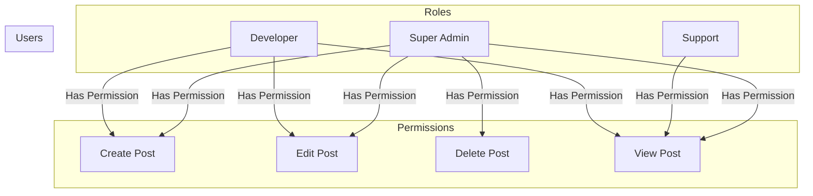

# Salvo Agency Technical Test | [Live Demo](#)
## Introduction
This is a technical test for Salvo Agency. The test is to create a simple web application that implements multi-tenancy level of authorization. The application is a simple CRUD application that allows users to create, read, update and delete a list of post. The application is built using the Laravel with Breeze scaffolding. The application is deployed on Heroku and can be accessed at [#](#).

## Demo Account
The application has a demo account that can be used to test the application. 
| Email | Role | Password |
| --- | --- | --- |
| support@demo.com | Support | password |
| developer@demo.com | Developer | password |
| superadmin@demo.com | Super Admin | password |

## Permission Graph

## Installation
### Install using Local Environment
1. Clone the repository
```bash
git clone https://github.com/hendurhance/salvo-crud.git
```
2. Go to the project directory
```bash
cd salvo-crud
```
3. Install the dependencies
    Run the script below to install the dependencies
```bash
scripts/dependencies.sh
```
4. Create a copy of the `.env.example` file and rename it to `.env`
```bash
cp .env.example .env
```
5. Generate the application key
```bash
php artisan key:generate
```
6. Setup the database
    - Create a new database
    - Update the database credentials in the `.env` file
7. Run the database migration
```bash
php artisan migrate
```
8. Run the database seeder
```bash
php artisan db:seed
```
9. Run the application
```bash
php artisan serve
```

### Install using Docker
1. Clone the repository
```bash
git clone https://github.com/hendurhance/salvo-crud.git
```
2. Go to the project directory
```bash
cd salvo-crud
```
3. Create a copy of the `.env.example` file and rename it to `.env`
```bash
cp .env.example .env
```
4. Build the docker image
```bash
docker-compose up -d
```
5. Run the container
```bash
docker exec -it salvo-app-1 bash
```
Make sure you are inside the container before running the next commands.
```bash
cd /var/www/html
```
6. Install the dependencies
```bash
scripts/dependencies.sh
```
If you are getting an error, run the command below to fix the permission.
```bash
chmod +x scripts/dependencies.sh
```
7. Run the database migration
```bash
php artisan migrate
```
8. Run the database seeder
```bash
php artisan db:seed
```
9. Run the test
```bash
php artisan test
```

## Technologies
The application is built using the following technologies:
- Laravel 10.10
- Laravel Breeze 1.23
- Spatie Laravel Permissions 5.11
- Heroku
- MySQL
- Docker
- Docker Compose
- PHP 8.1
- Composer
- NPM
- Tailwind CSS
- Alpine JS

## Features
The application has the following features:
- Multi-tenancy level of authorization
- CRUD Post
- User Management
- User Profile

## Testing
The application has the following tests:
- Unit Test
- Feature Test
A complete list of 40 tests assertion can be found in the `tests` directory.
